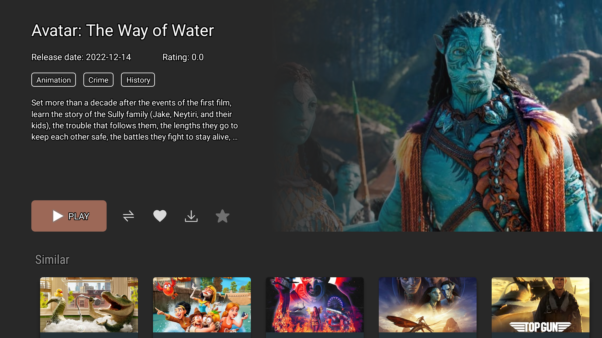

# TvApp
Several demo pages in leanback style

this demo based on [leanback](https://github.com/android/tv-samples)

and movie.json from [Tv-App](https://github.com/payelpaul121999/Tv-App/tree/main)

## home page

## movie page

## detail page
